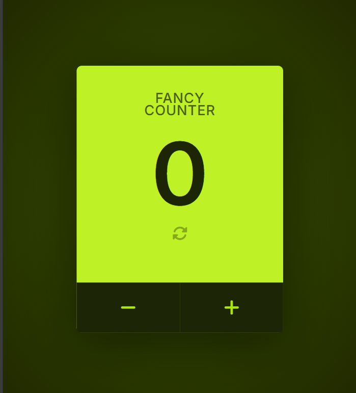

# Fancy Counter

A modern, interactive, and responsive counter application built using **HTML**, **CSS**, and **JavaScript**. This project demonstrates DOM manipulation, event handling, and dynamic UI updates with a sleek user interface.

---

## ✨ Features

- ➕ Increment counter
- ➖ Decrement counter
- 🔄 Reset counter
- 🎯 Real-time value updates
- 🎨 Modern and attractive UI
- 📱 Fully responsive design
- ⚡ Fast and lightweight

---
## 📸 Preview


---


## 🛠️ Built With

- HTML5
- CSS3
- JavaScript (ES6)

---

## 📂 Project Structure

```
Fancy-Counter/
│
├── index.html
├── style.css
├── script.js
├── images/
│   └── preview.png
└── README.md
```

---

## 🎯 How It Works

- Click **+** to increase the counter.
- Click **-** to decrease the counter.
- Click **Reset** to set the counter back to zero.
- The displayed value updates instantly using JavaScript.

---

## 💻 Getting Started

Clone the repository

```bash
git clone https://github.com/lakshmip24/fancy-counter.git
```

Navigate into the project folder

```bash
cd fancy-counter
```

Open `index.html` in your browser.

---

## 📚 Concepts Used

- Variables
- Functions
- DOM Manipulation
- Event Listeners
- JavaScript Events
- CSS Flexbox
- Responsive Design

---

## 🌟 Future Improvements

- 🌙 Dark/Light mode
- 🎵 Sound effects
- 🎨 Multiple color themes
- 📈 Counter history
- ⌨️ Keyboard shortcuts
- 💾 Save counter value using Local Storage
- ✨ Smooth animations

---

## 🤝 Contributing

Contributions are welcome!

1. Fork the repository
2. Create a new branch

```bash
git checkout -b feature-name
```

3. Commit your changes

```bash
git commit -m "Add new feature"
```

4. Push to your branch

```bash
git push origin feature-name
```

5. Open a Pull Request

---


## 👩‍💻 Author

**Lakshmi Pradeep**

If you like this project, don't forget to ⭐ the repository!

Happy Coding! 🚀
